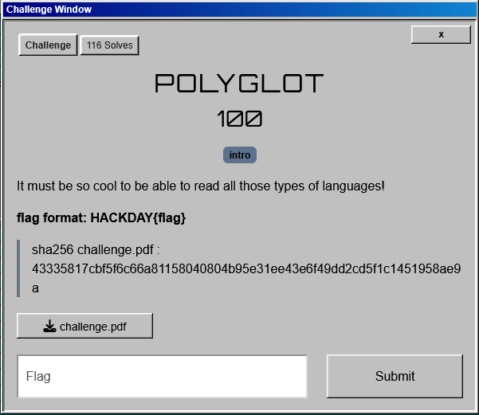
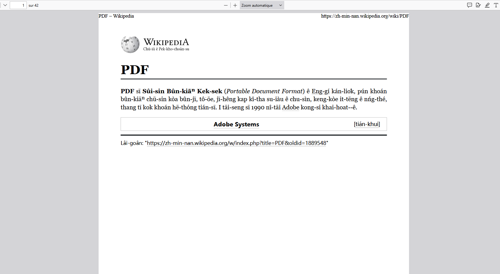
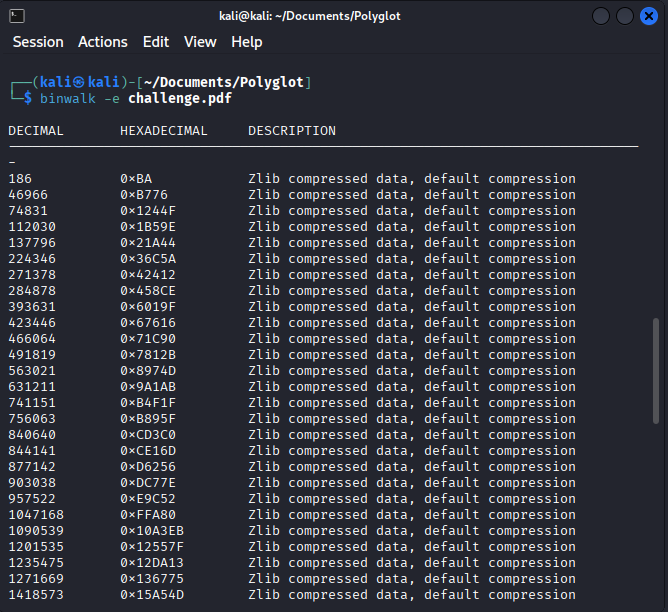
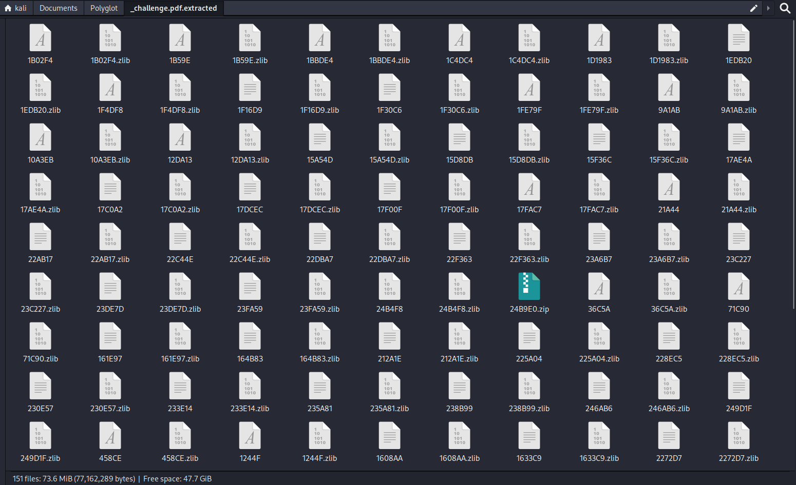
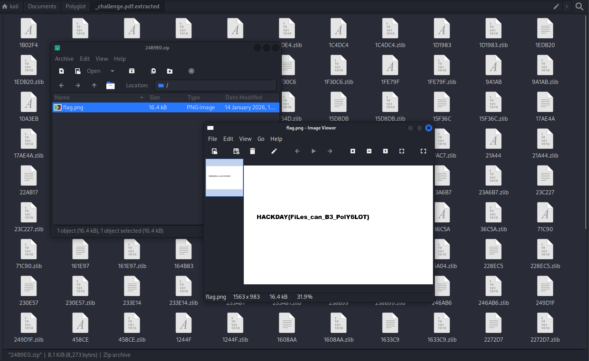

# Write-Up : POLYGLOT (HackDay ESIEE)

**Plateforme :** HackDay   
**Catégorie :** Stéganographie   
**Difficulté :** Facile / Introduction   

## Objectif

L'objectif est d'identifier la nature **polyglotte** d'un document PDF pour extraire une archive **ZIP cachée** dans sa structure et ainsi récupérer le flag.

<em>Fenêtre du challenge Polyglot</em>

## Analyse Initiale

Le challenge fournit un fichier nommé challenge.pdf (SHA256 : 43335817cbf5f6...).

* **Contenu :** À l'ouverture, le document affiche une page Wikipédia sur le format PDF en langue Min-nan.

* **Indice :** Le titre "Polyglot" suggère que le fichier est valide dans plusieurs formats simultanément (par exemple PDF et ZIP).

<em>Aperçu du fichier PDF trompeur</em>

## Analyse Forensic

Pour vérifier la présence de données cachées, j'ai utilisé l'outil **binwalk** dans un environnement Kali Linux.

**Commande utilisée :**

binwalk -e challenge.pdf 

**Résultats de l'analyse :**

* L'outil identifie de nombreux flux de données compressées (Zlib) typiques d'un PDF.

* À l'offset **0x24B9E0**, une signature d'archive **ZIP** est détectée.

* Cette archive contient un fichier nommé **flag.png**.

## Extraction et Flag

Grâce à l'option -e de binwalk, l'archive a été automatiquement extraite.

En ouvrant le fichier flag.png extrait de l'archive 24B9E0.zip, le flag apparaît en clair sur l'image.

**Flag :** HACKDAY{FiLes_can_B3_PolY6LOT} 

## Conclusion

Ce challenge illustre la capacité des formats de fichiers à être **"polyglottes"**.
Un fichier PDF peut contenir une archive ZIP à la suite de son marqueur de fin (%%EOF). Cela permet au fichier d'être lu normalement par un lecteur PDF, tout en restant une archive valide pour un logiciel de décompression.
