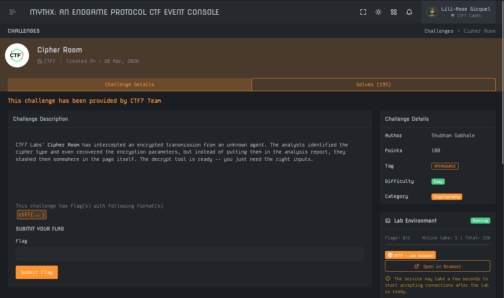
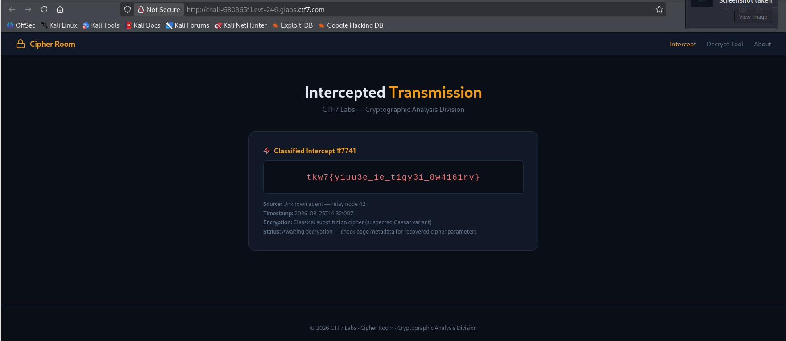
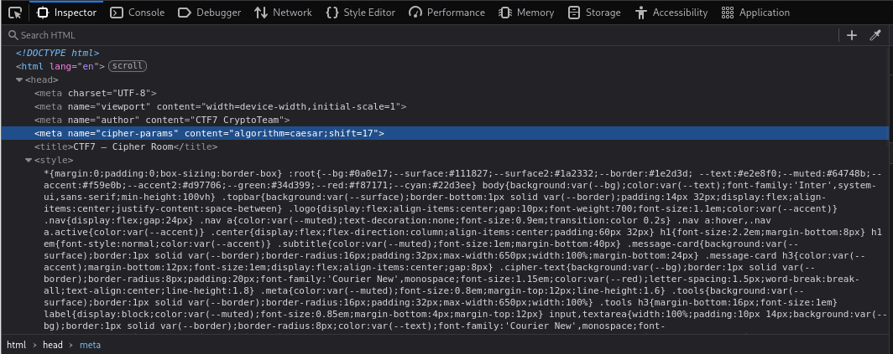
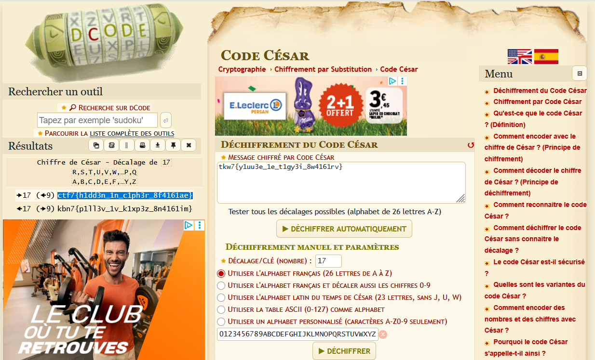

# Write-Up : Cipher Room

**Plateforme :** MYTHX: AN ENDGAME PROTOCOL   
**Catégorie :** Cryptography   
**Difficulté :** Easy   

## Objectif

L'objectif de ce challenge est d'intercepter et de déchiffrer une transmission sécurisée provenant d'un agent inconnu. Les analystes ont identifié le type de chiffrement, mais les paramètres nécessaires à la décryption ont été dissimulés dans les métadonnées de la page web du laboratoire.

<p align="center">

</p>
<p align="center"><em>Interface du challenge présentant l'énoncé et l'accès au laboratoire </em> </p>

## Analyse Initiale

En accédant à l'environnement du laboratoire, nous sommes confrontés à une interface de transmission interceptée. Les informations affichées sont les suivantes :

* **Message Chiffré :** `tkw7{y1uu3e_1e_t1gy3i_8w4161rv}`

* **Source :** Unknown agent — relay node 42 

* **Encryption :** Classical substitution cipher (suspected Caesar variant) 

* **Status :** Awaiting decryption — check page metadata for recovered cipher parameters 

<p align="center">

</p>
<p align="center"><em>Transmission interceptée affichant le texte crypté </em> </p>

**Indice critique :** Le message d'état indique explicitement que les paramètres se trouvent dans les "page metadata".

## Recherche des Paramètres (Metadata)

Pour récupérer la clé de déchiffrement, nous utilisons l'outil Inspecteur du navigateur (F12) afin d'examiner le code source HTML de la page, plus particulièrement la section <head>.

L'analyse révèle une balise meta spécifique ajoutée par l'équipe de cryptographie :

```HTML
<meta name="cipher-params" content="algorithm=caesar;shift=17">
```

<p align="center">

</p>
<p align="center"><em>Extraction du paramètre "shift=17" depuis les balises meta </em> </p>

Cette découverte confirme que l'algorithme est un Chiffre de César avec un décalage de 17.

## Déchiffrement et Analyse

Le texte chiffré est `tkw7{y1uu3e_1e_t1gy3i_8w4161rv}`. En appliquant un décalage de César de 17 (ce qui correspond à un décalage inverse de 9 dans un alphabet de 26 lettres), nous obtenons le message en clair.

| Caractère Chiffré	| Décalage (-17) | Caractère Clair |
| :--- | :--- | :--- |
| t	| -17	| c |
| k	| -17	| t |
| w	| -17	| f |
| 7	| (Chiffre)	| 7 |

Le début du flag `ctf7{` valide immédiatement la méthode de déchiffrement.

<p align="center">

</p>
<p align="center"><em>Utilisation de l'outil dCode pour appliquer le décalage de 17 </em> </p>

## Synthèse du Flag

En traitant l'intégralité de la chaîne via un convertisseur automatique (comme dCode), nous obtenons la destination finale de la transmission.

* **Texte Chiffré :** `tkw7{y1uu3e_1e_t1gy3i_8w4161rv}`

* **Paramètre :** Shift 17 

* **Message Clair :** `ctf7{h1dd3n_1n_c1ph3r_8f4161ae}` 

## Conclusion

Le challenge Cipher Room démontre l'importance de l'analyse des sources web lors d'une investigation. Bien que le chiffrement de César soit une technique simple, sa résolution dépendait ici de la capacité à identifier une information technique dissimulée volontairement dans les métadonnées structurelles de la page (balises meta) plutôt que dans le contenu visible.

**Flag final :**

`ctf7{h1dd3n_1n_c1ph3r_8f4161ae}`
