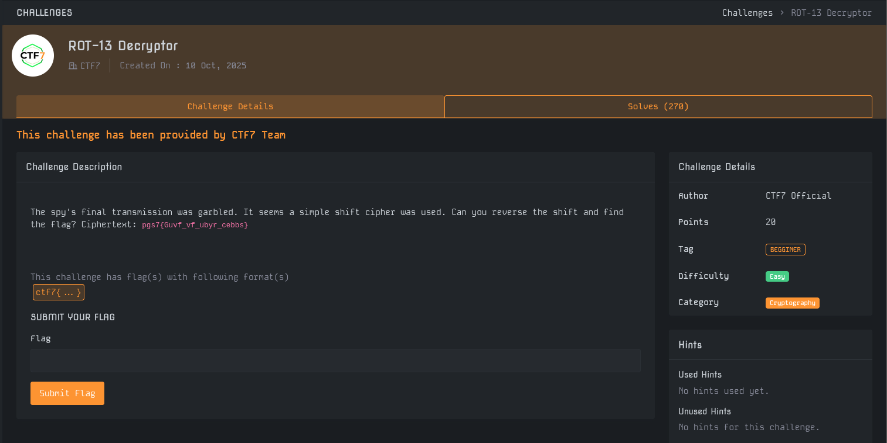
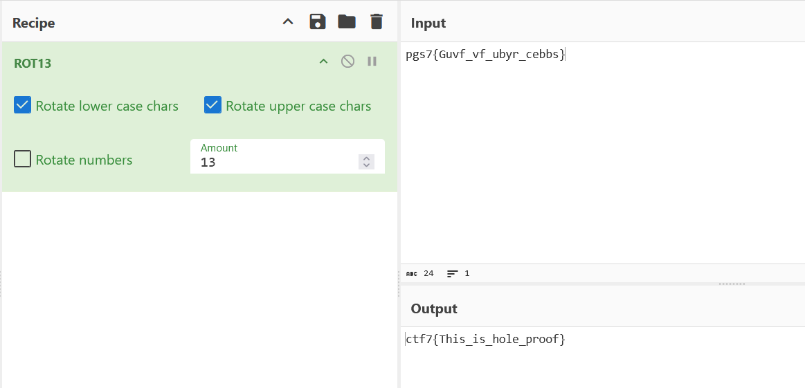

# Write-Up : ROT-13 Decryptor

**Plateforme :** MYTHX: AN ENDGAME PROTOCOL   
**Catégorie :** Cryptography   
**Difficulté :** Easy   

## Objectif

L'objectif de ce challenge est de rétablir une transmission finale d'un espion qui a été brouillée. L'analyse préliminaire indique qu'un chiffrement par décalage a été utilisé pour masquer le flag. 

<em>Interface du challenge présentant l'énoncé et le texte chiffré</em> 

## Analyse Initiale

Les informations extraites sont les suivantes :

* **Message Chiffré :** `pgs7{Guvf_vf_ubyr_cebbs}` 

* **Type de chiffrement :** Simple shift cipher 

* **Format du flag :** `ctf7{ ... }`

**Indice :** Le titre du challenge, "ROT-13 Decryptor", suggère fortement que le décalage utilisé est de 13 positions dans l'alphabet. 

## Recherche des Paramètres

Contrairement à d'autres missions, la clé n'est pas cachée dans les métadonnées, mais est explicitement nommée dans l'intitulé de la tâche : ROT-13. Le ROT-13 est un cas particulier du chiffre de César où chaque lettre est remplacée par la lettre située 13 places plus loin dans l'alphabet. 

## Déchiffrement et Analyse

Le texte chiffré identifié est `pgs7{Guvf_vf_ubyr_cebbs}`. En utilisant un outil de traitement comme CyberChef avec la recette ROT13 (décalage de 13), nous procédons à la conversion. 

| Caractère Chiffré	| Décalage (13)	| Caractère Clair |
| :--- | :--- | :--- |
| p	| +13	| c |
| g	| +13	| t |
| s	| +13	| f |
| 7	| (Fixe)	| 7 |

Le passage de pgs7 à ctf7 confirme que l'algorithme et le décalage appliqués sont corrects. 

<em>Utilisation de CyberChef pour appliquer le décalage ROT13</em> 

## Synthèse du Flag

Le traitement complet de la chaîne de caractères permet de reconstruire le message original de l'espion. 

* **Texte Chiffré :** `pgs7{Guvf_vf_ubyr_cebbs}` 

* **Paramètre :** Shift 13 (ROT13) 

* **Message Clair :** `ctf7{This_is_hole_proof}`

## Conclusion

Le challenge ROT-13 Decryptor est une introduction aux bases de la cryptographie. Le titre du challenge indiquait directement d'utiliser le standard ROT13 et l'utilisation d'un outil comme CyberChef a permis de transformer instantanément le texte illisible en flag exploitable.

**Flag final :**

`ctf7{This_is_hole_proof}`
