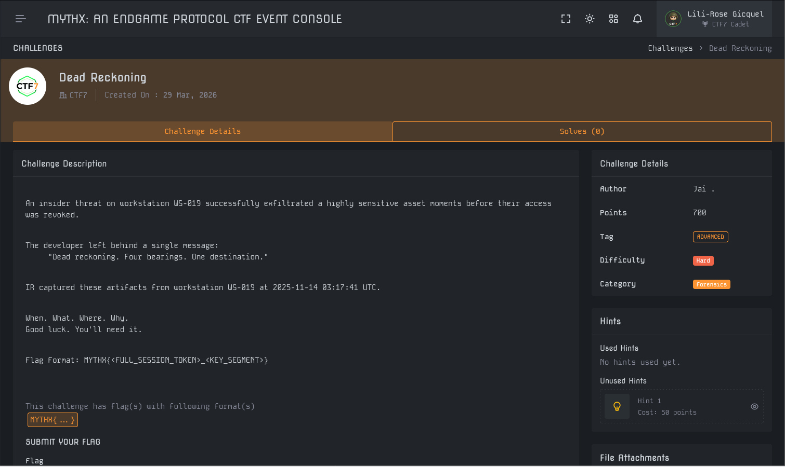
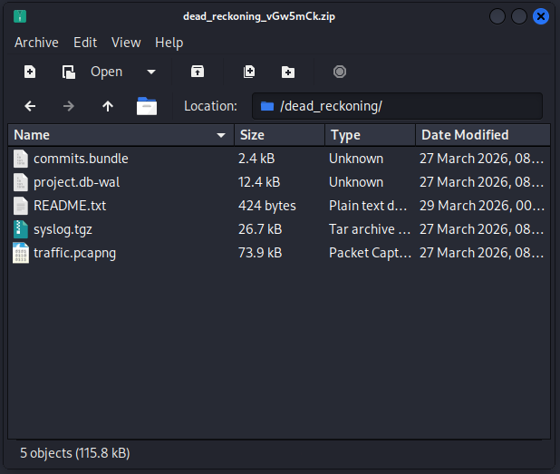
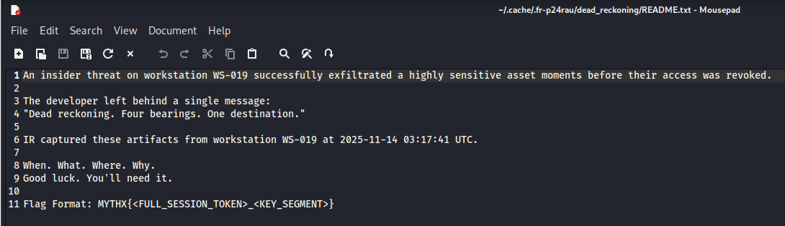
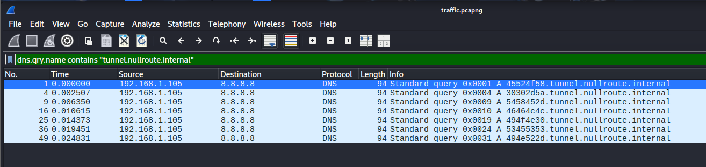
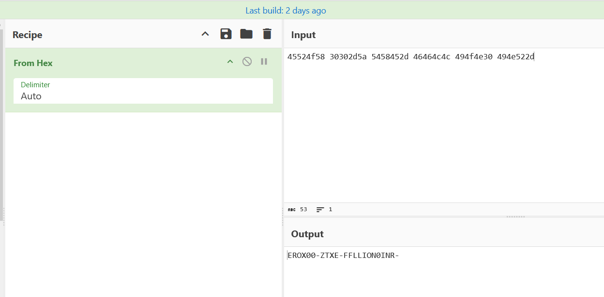

# Write-Up : Dead Reckoning (Investigation Report)

**Plateforme :** MYTHX: AN ENDGAME PROTOCOL    
**Catégorie :** Forensics    
**Difficulté :** Hard    

## Objectif

L'objectif est d'analyser les traces laissées par un "insider threat" (menace interne) sur le poste de travail WS-019 afin de récupérer un actif sensible exfiltré juste avant la révocation de ses accès.

<p align="center">

</p>
<p align="center"><em>Interface du challenge présentant l'énoncé et les fichiers</em> </p>

## Analyse Initiale

Le challenge fournit un fichier `dead_reckoning_vGw5mCk.zip` contenant plusieurs artefacts forensic :

* `traffic.pcapng` : Capture réseau du poste de travail.

* `commits.bundle` : Historique Git local du développeur.

* `README.txt` : Contient un message cryptique laissé par le suspect.

<p align="center">

</p>
<p align="center"><em>Liste des artefacts fournis dans l'archive</em> </p>

**Indice critique :** "Dead reckoning. Four bearings. One destination.". Cet indice suggère une navigation précise : quatre points de repère (bearings) mènent à une cible unique (destination).

<p align="center">

</p>
<p align="center"><em>Indice trouvé dans README.txt</em> </p>

## Analyse Forensic Réseau (PCAP)

L'analyse de traffic.pcapng avec Wireshark révèle une activité suspecte via le protocole DNS. Le suspect utilise une technique de DNS Tunneling via le domaine interne `tunnel.nullroute.internal` pour exfiltrer des données par morceaux de 8 caractères hexadécimaux.

<p align="center">

</p>
<p align="center"><em>Filtrage des requêtes DNS vers le domaine de tunnel</em> </p>

En utilisant le filtre `dns.qry.name contains "tunnel.nullroute.internal"` et en convertissant l'hexadécimal en ASCII via CyberChef, nous avons identifié les segments suivants :

<p align="center">

</p>
<p align="center"><em>Décodage des segments hexadécimaux dans CyberChef</em> </p>

| Paquet | Hexadécimal | ASCII (From Hex) | Rôle |
| :--- | :--- | :--- | :--- |
| 1 | 45524f58 | EROX | Bearing 1 |
| 4 | 30302d5a | 00-Z | Bearing 2 | 
| 9 | 5458452d | TXE- | Bearing 3 | 
| 16 | 46464c4c | FFLL | Bearing 4 |
| 25 | 494f4e30 | ION0 | Segment additionnel | 
| 36 | 53455353 | SESS | Marqueur Session |
| 49 | 494e522d | INR- | Destination exfiltrée |

## Analyse de l'Historique Git

Le message "One destination" et l'indice "commit 3" trouvé dans les fichiers suggèrent que l'identifiant de la session se trouve dans le dépôt.

**Commande utilisée :**

```Bash
git clone commits.bundle repo_challenge
git log -p
```

L'historique révèle une forme de stéganographie textuelle : des fautes de frappe délibérées dans les messages de commit forment le mot secret OKAYPN (remoove, fixk, REAADME, layyer, depps, connnection).

De plus, en comptant depuis le premier commit de l'historique, le commit 3 (identifié par le hash `1057bbccbfb749a21d56186b8f60ca934802d6ff`) est explicitement cité comme un "integration checkpoint".

## Synthèse du Flag (Pistes explorées)

Le format attendu est MYTHX{<FULL_SESSION_TOKEN>_<KEY_SEGMENT>}.

* **KEY_SEGMENT :** Basé sur les "Four Bearings" DNS → EROX00-ZTXE-FFLL.

* **FULL_SESSION_TOKEN :** Cette partie constitue le cœur du problème. Elle semble combiner le hash du commit 3 et les données exfiltrées après le marqueur SESS.

## Échecs et Itérations

Malgré une compréhension complète des mécanismes, le flag final n'a pas pu être validé. Plusieurs hypothèses ont été explorées sans succès :

* **L'hypothèse du Hash direct :** Utilisation du hash complet ou court (1057bbcc) du commit 3 comme token.

* **L'hypothèse du code secret :** Intégration du mot OKAYPN comme préfixe au token de session.

* **L'hypothèse du fichier chiffré :** Le commit 04b74bb ajoute un fichier config.enc. Il est fort probable que le véritable token soit contenu dans ce fichier, nécessitant le hash du commit ou le mot OKAYPN comme clé de déchiffrement AES. Sans ce déchiffrement, l'assemblage manuel du token est resté infructueux.

## Conclusion

Ce challenge est une épreuve de corrélation complexe. Il démontre comment un attaquant peut fragmenter une clé de session entre un historique Git (données persistantes) et un tunnel DNS (données volatiles). La difficulté résidait dans l'ordre exact de reconstruction et le déchiffrement potentiel d'un artefact caché dans les commits, rendant le flag final particulièrement difficile à saisir.
