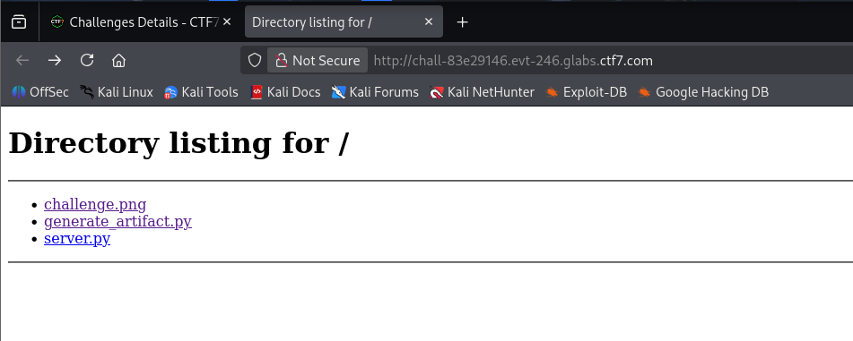
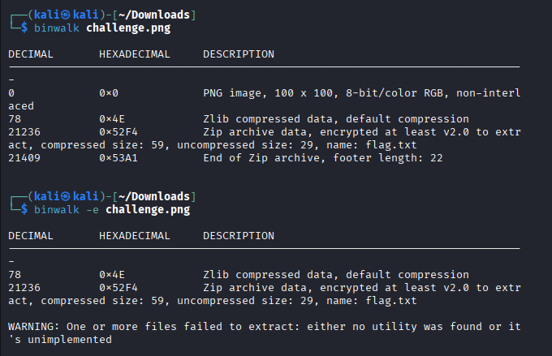
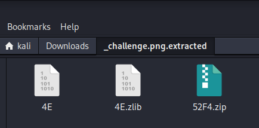
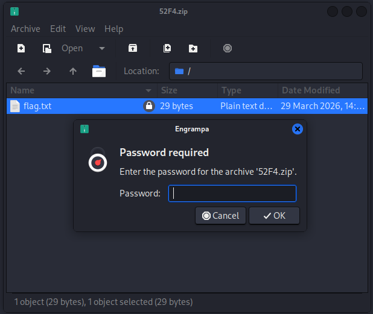
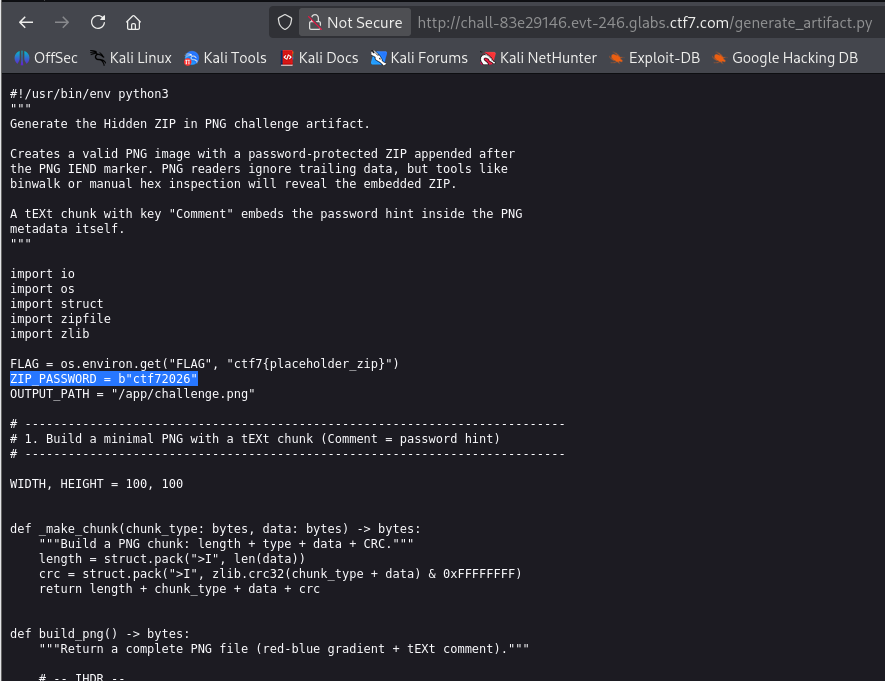

# Write-Up : Hidden ZIP in PNG

**Plateforme :** CTF7  
**Catégorie :** Forensics / Stéganographie  
**Difficulté :** Medium  

## Objectif

L'objectif est d'identifier et d'extraire une archive **ZIP dissimulée** dans la structure binaire d'un fichier **PNG**, puis de contourner sa protection par mot de passe pour récupérer le flag.

<p align="center">

</p>
<p align="center"><em>Répertoire source du challenge présentant l'artefact et les scripts</em> </p>

## Analyse Initiale

Le challenge met à disposition un fichier `challenge.png`. L'énoncé suggère que des données intéressantes sont cachées "juste après la fin" du fichier.

* **Fichiers disponibles :** `challenge.png`, `generate_artifact.py` (script de création) et `server.py`.
* **Hypothèse :** Utilisation de la stéganographie par concaténation (EOF data).

## Analyse Forensic

Pour vérifier la structure du fichier, j'ai utilisé l'outil **binwalk** dans un environnement Kali Linux.

**Commande utilisée :**
```bash
binwalk challenge.png
```

<p align="center">

</p>
<p align="center"><em>Analyse binaire révélant l'archive ZIP à l'offset 0x52F4</em> </p>

**Résultats de l'analyse :**

* Le fichier est bien une image PNG valide.

* À l'offset 0x52F4, une signature d'archive ZIP est détectée.

* L'archive contient un fichier nommé **flag.txt**.

**Extraction et Mot de Passe**

L'archive a été extraite automatiquement avec l'option -e de binwalk, créant un répertoire `_challenge.png.extracted` contenant le fichier `52F4.zip`.

<p align="center">


</p>
<p align="center"><em>Fichiers extraits et demande de mot de passe pour le ZIP</em> </p>

En tentant d'ouvrir flag.txt, une authentification est requise. L'analyse du code source `generate_artifact.py` révèle le secret utilisé lors de la création du challenge.

**Code source critique :**

`ZIP_PASSWORD = b"ctf72026"`

Le mot de passe est donc **ctf72026**.

## Obtention du Flag

En saisissant le mot de passe, le fichier `flag.txt` devient accessible.

<p align="center">

</p>
<p align="center"><em>Contenu du fichier flag.txt extrait</em> </p>

`Flag : ctf7{zip_in_hidden_d10530ba}`

## Conclusion

Ce challenge démontre comment un fichier peut être polyglotte : il est lu comme une image par les logiciels classiques, mais contient une archive cachée après sa signature de fin (IEND).

L'utilisation de binwalk permet de révéler cette structure invisible à l'œil nu. Enfin, l'analyse du code source (generate_artifact.py) rappelle qu'en CTF, les fichiers annexes contiennent souvent les clés nécessaires pour éviter de perdre du temps en force brute.
