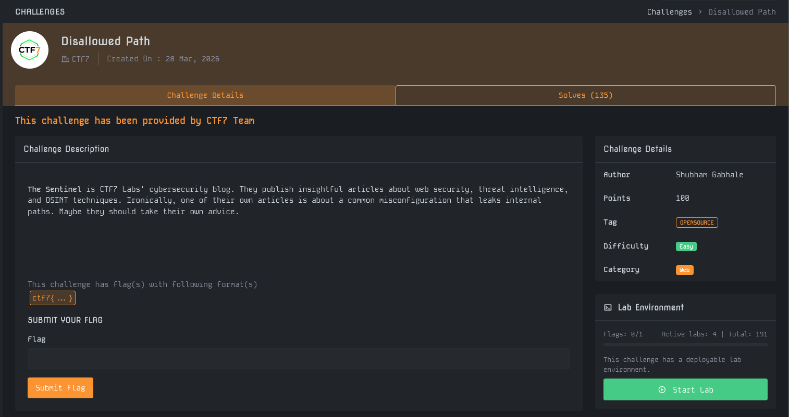
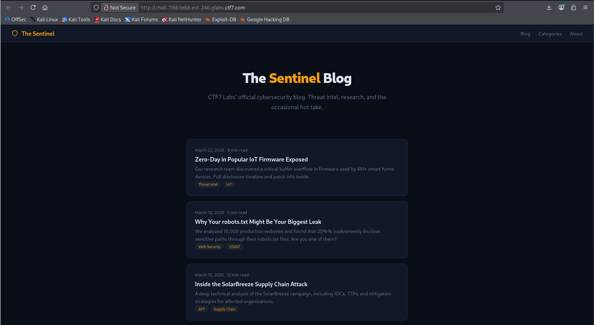
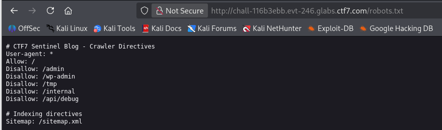
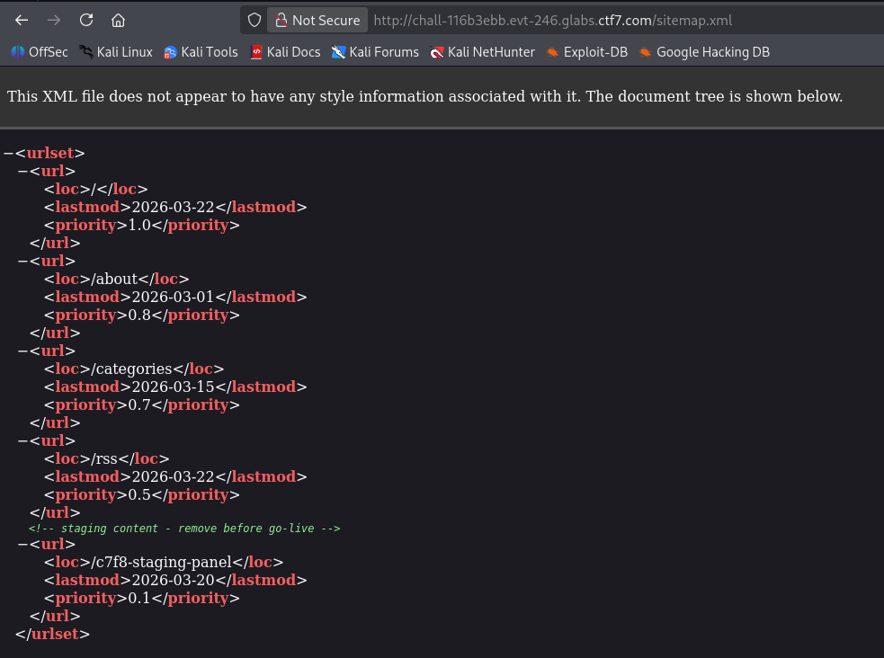
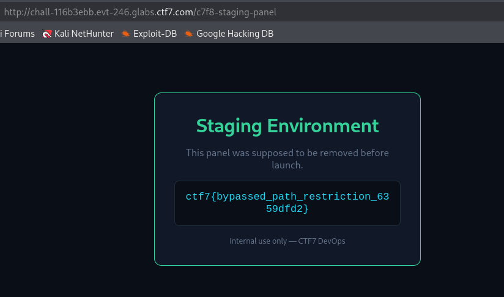

# Write-Up : Disallowed Path

**Plateforme :** MYTHX: AN ENDGAME PROTOCOL  
**Catégorie :** Web   
**Difficulté :** Easy   

## Objectif

L'objectif de ce challenge est d'exploiter une mauvaise configuration courante qui divulgue des chemins internes via des fichiers de directives destinés aux robots et aux moteurs de recherche.

<em>Interface du challenge présentant l'énoncé et les détails </em> 

## Analyse Initiale

Les informations extraites de la plateforme sont les suivantes :

* **Cible :** The Sentinel, le blog de cybersécurité de CTF7 Labs.

* **Indice :** L'énoncé mentionne ironiquement que le blog a publié un article sur les fuites de chemins internes alors qu'il en est lui-même victime.

* **Format du flag :** `ctf7{ ... }`.

L'analyse commence par l'exploration de la page d'accueil du blog pour identifier des vecteurs potentiels de fuite d'information.

<em>Page d'accueil du blog The Sentinel montrant l'article sur robots.txt </em> 

## Recherche des Paramètres

L'article intitulé "Why Your robots.txt Might Be Your Biggest Leak" est une indication directe d'examiner le fichier robots.txt à la racine du site.

En accédant à `http://[URL]/robots.txt`, on découvre plusieurs répertoires interdits aux crawlers:

`/admin, /wp-admin, /tmp, /internal, /api/debug` 

Cependant, une directive d'indexation supplémentaire en bas du fichier attire l'attention :

`Sitemap: /sitemap.xml` 

<em>Contenu du fichier `robots.txt` listant les chemins disallowed et le sitemap </em> 

## Déchiffrement et Analyse

En naviguant vers http://[URL]/sitemap.xml, nous accédons à la structure XML listant les URL du site. Un commentaire de développeur révèle un contenu de test (staging) qui n'a pas été retiré avant la mise en ligne:

Ce commentaire précède une URL spécifique : `/c7f8-staging-panel`.

| Fichier Source | Élément Critique identifié | Type de donnée |
| :--- | :--- | :--- |
| robots.txt | Sitemap: /sitemap.xml | Vecteur de reconnaissance 
| sitemap.xml | /c7f8-staging-panel | Chemin caché (Staging) |

<em>Fichier sitemap.xml exposant le dossier de staging confidentiel </em> 

## Synthèse du Flag

L'accès à l'URL découverte permet d'entrer dans l'environnement de staging réservé aux équipes DevOps de CTF7, où le flag est affiché en clair.

* **Chemin :** `/c7f8-staging-panel` 

* **Environnement :** Staging Environment 

* **Valeur :** `ctf7{bypassed_path_restriction_6359dfd2}`

<em>Panneau de staging révélant le flag de restriction de chemin </em> 

## Conclusion

Le challenge Disallowed Path illustre la dangerosité de l'obscurité par la sécurité. Le fichier robots.txt et le sitemap.xml ne doivent jamais être considérés comme des mécanismes de protection, car ils fournissent aux attaquants une liste exhaustive des zones sensibles à explorer en priorité.

**Flag final :**

`ctf7{bypassed_path_restriction_6359dfd2}`
