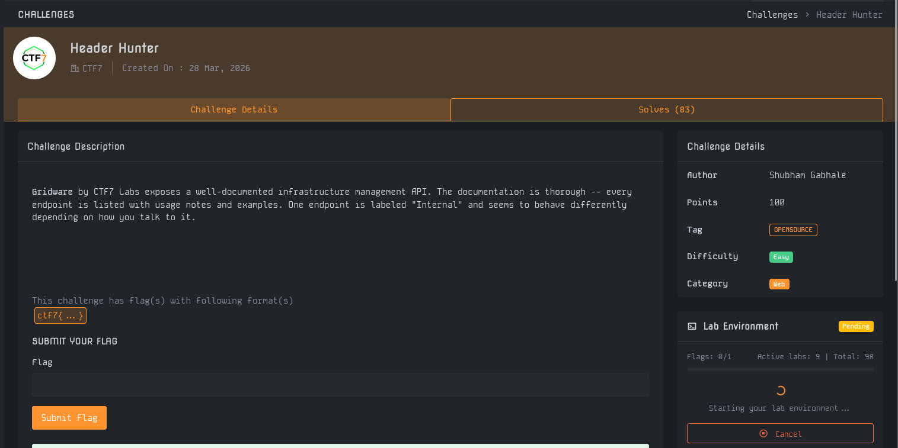
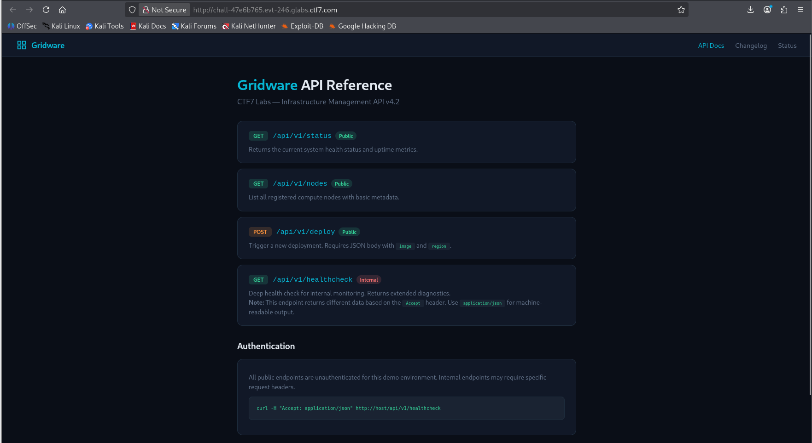
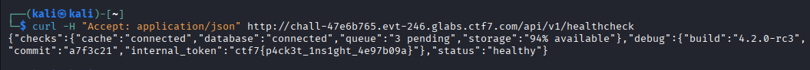

# Write-Up : Header Hunter

**Plateforme :** MYTHX: AN ENDGAME PROTOCOL  
**Catégorie :** Web    
**Difficulté :** Easy   

## Objectif

L'objectif de ce challenge est d'exploiter la configuration d'une API de gestion d'infrastructure pour accéder à un point de terminaison interne et extraire des informations sensibles via la manipulation des en-têtes HTTP.

<em>Interface du challenge présentant l'énoncé et les détails</em> 

## Analyse Initiale

Les informations extraites de la plateforme sont les suivantes :

* **Cible :** API Gridware par CTF7 Labs.

* **Indice :** Un endpoint nommé "Internal" se comporte différemment selon la manière dont on interagit avec lui ("how you talk to it").

* **Format du flag :** `ctf7{ ... }`.

L'analyse de la documentation de l'API révèle plusieurs points de terminaison publics, mais un attire l'attention : `/api/v1/healthcheck`, marqué comme `Internal`.

<em>Documentation de l'API Gridware montrant l'endpoint interne</em> 

## Recherche des Paramètres

La documentation fournit une note cruciale concernant l'endpoint `/api/v1/healthcheck` : il renvoie des données différentes en fonction de l'en-tête Accept. Il est suggéré d'utiliser `application/json` pour obtenir une sortie lisible par machine.

L'en-tête Accept est un mécanisme de négociation de contenu HTTP.

Un exemple de commande curl est même fourni pour tester cette interaction :

`curl -H "Accept: application/json" http://[HOST]/api/v1/healthcheck`

## Déchiffrement et Analyse

En exécutant la commande demandée via un terminal, nous interrogeons l'API en spécifiant que nous souhaitons recevoir du JSON. Le serveur traite la requête et renvoie un objet structuré contenant l'état des services (cache, base de données, stockage).

| Champ JSON	| Valeur identifiée	| Type de donnée |
| :--- | :--- | :--- |
| checks	| connected / pending	| État du système |
| debug	| internal_token	| Donnée sensible / Flag |
| status	| healthy | État général |

L'analyse de la section debug révèle la présence d'une clé internal_token qui n'est normalement pas affichée lors d'une requête standard via un navigateur.

<em>Exécution de la commande curl révélant le contenu de l'objet debug</em> 

## Synthèse du Flag

L'extraction directe depuis la réponse JSON de l'API permet de récupérer le flag final :

* **Endpoint :** `/api/v1/healthcheck`

* **Header utilisé :** `Accept: application/json`

* **Valeur du token :** `ctf7{p4ck3t_1ns1ght_4e97b09a}`

## Conclusion

Le challenge Header Hunter illustre l'importance de la visibilité des données selon le format de réponse demandé. Une mauvaise gestion de la verbosité dans les réponses API (souvent appelée Improper Assets Management ou Information Disclosure) peut permettre à un utilisateur de récupérer des secrets techniques, comme ici un jeton de débogage interne contenant le flag.

**Flag final :**

`ctf7{p4ck3t_1ns1ght_4e97b09a}`
