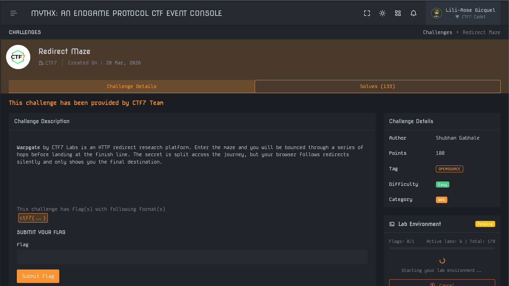
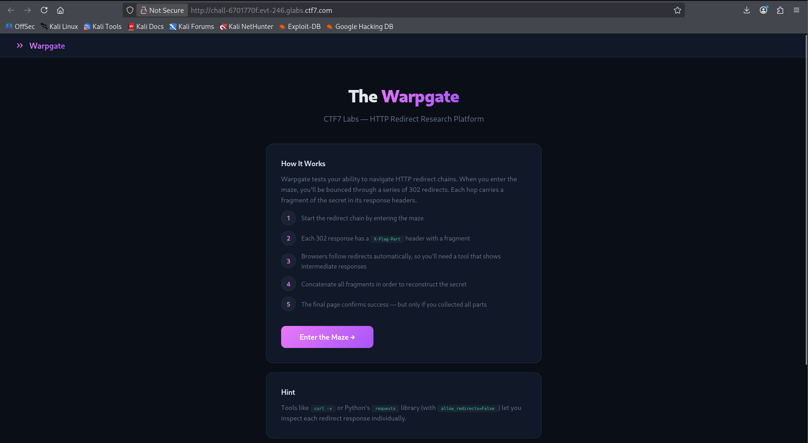
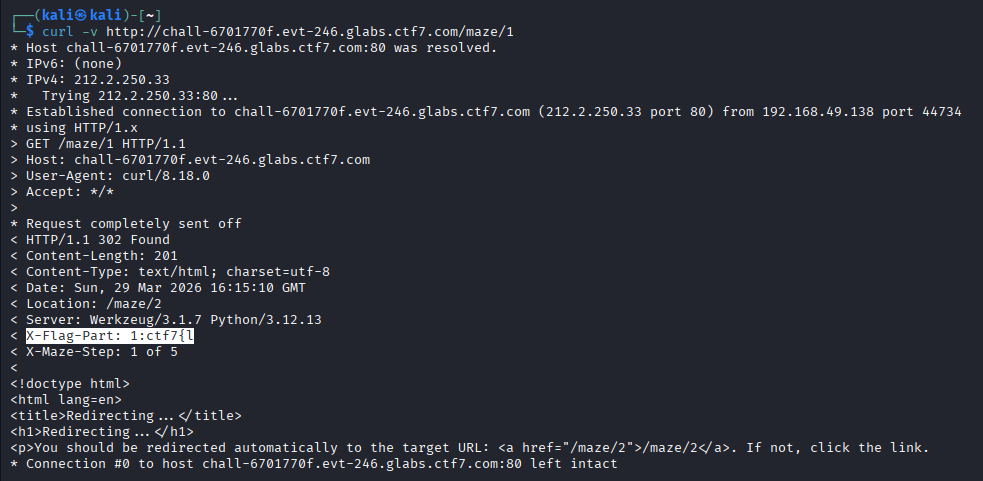
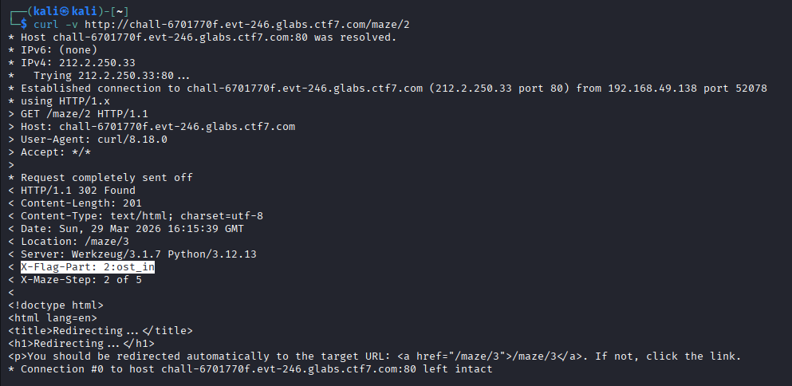
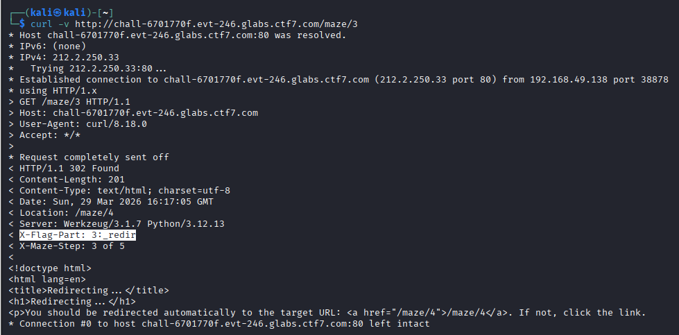
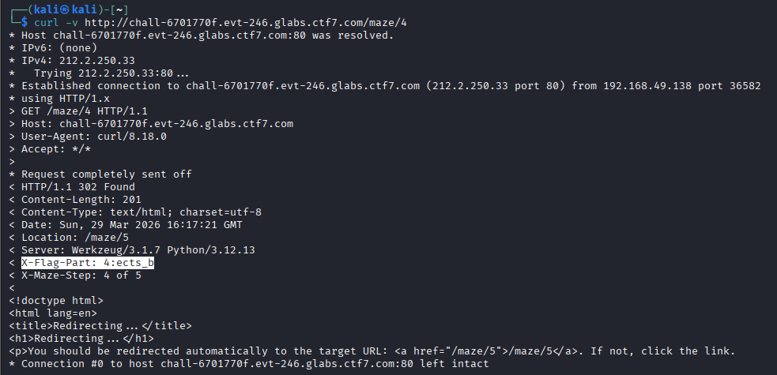
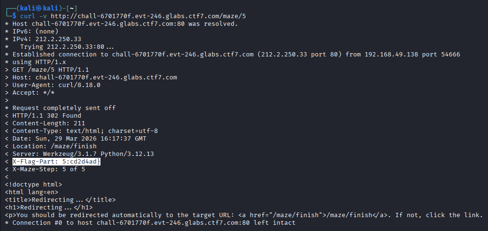

# Write-Up : Redirect Maze

**Plateforme :** MYTHX: AN ENDGAME PROTOCOL   
**Catégorie :** Web   
**Difficulté :** Easy    

## Objectif

L'objectif de ce challenge est d'analyser le comportement des redirections HTTP pour identifier des informations sensibles transitant par les en-têtes de réponse, lesquelles sont normalement masquées par le comportement automatique des navigateurs web. 

<em>Interface du challenge présentant l'énoncé et les détails</em> 

## Analyse Initiale

Les informations extraites de la plateforme sont les suivantes :

* **Cible :** Warpgate, une plateforme de recherche sur les redirections HTTP. 

* **Indice :** Le secret est divisé à travers le parcours, mais le navigateur suit les redirections silencieusement et n'affiche que la destination finale. 

* **Mécanique :** Chaque réponse `HTTP 302 Found` contient un en-tête personnalisé `X-Flag-Part` avec un fragment du secret. 

* **Format du flag :** `ctf7{ ... }`. 

L'analyse commence par l'accès à la plateforme Warpgate pour identifier le point d'entrée du labyrinthe. 

<em>Page d'accueil de la plateforme Warpgate</em> 

## Recherche des Paramètres

L'utilisation d'outils comme curl avec l'option -v (verbose) permet d'inspecter les en-têtes de chaque réponse. En initiant la première requête vers `/maze/1`, on observe le premier fragment du flag et la directive de redirection vers l'étape suivante. 

`curl -v http://[URL]/maze/1`

<em>Première étape révélant X-Flag-Part: 1:ctf7{l et la redirection vers /maze/2</em> 

L'en-tête X-Maze-Step indique que le labyrinthe comporte 5 étapes au total. 

## Déchiffrement et Analyse

En suivant manuellement chaque redirection indiquée par l'en-tête Location, on extrait successivement les fragments du flag. 

| Étape | URL | Fragment identifié (X-Flag-Part) | Rôle |
| :--- | :--- | :--- | :--- |
| 1	| /maze/1	| 1:ctf7{l	| Début du flag |
| 2	| /maze/2	| 2:ost_in	| Fragment milieu |
| 3	| /maze/3	| 3:_redir	| Fragment milieu |
| 4	| /maze/4	| 4:ects_b	| Fragment milieu |
| 5	| /maze/5	| 5:cd2d4ad}	| Fin du flag | 

Chaque fragment est préfixé par son numéro d'ordre (ex: 1:, 2:), facilitant la reconstruction. 

<em>Interception de la 2ème étape montrant le fragment "ost_in"</em> 

<em>Interception de la 3ème étape montrant le fragment "_redir"</em> 

<em>Interception de la 4ème étape montrant le fragment "ects_b"</em> 

<em>Interception de la 5ème et dernière étape révélant la fin du flag</em> 

## Synthèse du Flag

La concaténation des valeurs après les deux-points de chaque en-tête X-Flag-Part permet de reconstituer le flag complet : 

* **Partie 1 :** `ctf7{l` 

* **Partie 2 :** `ost_in` 

* **Partie 3 :** `_redir` 

* **Partie 4 :** `ects_b` 

* **Partie 5 :** `cd2d4ad}` 

Reconstruction : `ctf7{l + ost_in + _redir + ects_b + cd2d4ad} = ctf7{lost_in_redirects_bcd2d4ad}`

## Conclusion

Le challenge Redirect Maze illustre l'importance d'auditer les flux de trafic HTTP complets. De nombreuses informations de débogage ou des secrets peuvent être accidentellement transmis dans les en-têtes de réponses de redirection, des données qui échappent souvent à la surveillance si l'on ne se fie qu'au rendu final affiché par le navigateur. 

**Flag final :**

`ctf7{lost_in_redirects_bcd2d4ad}`
