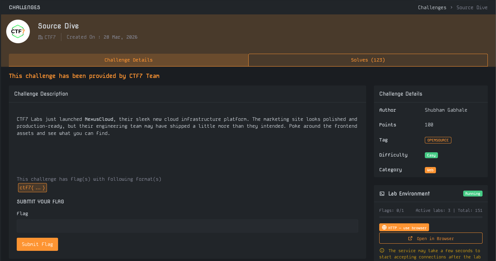
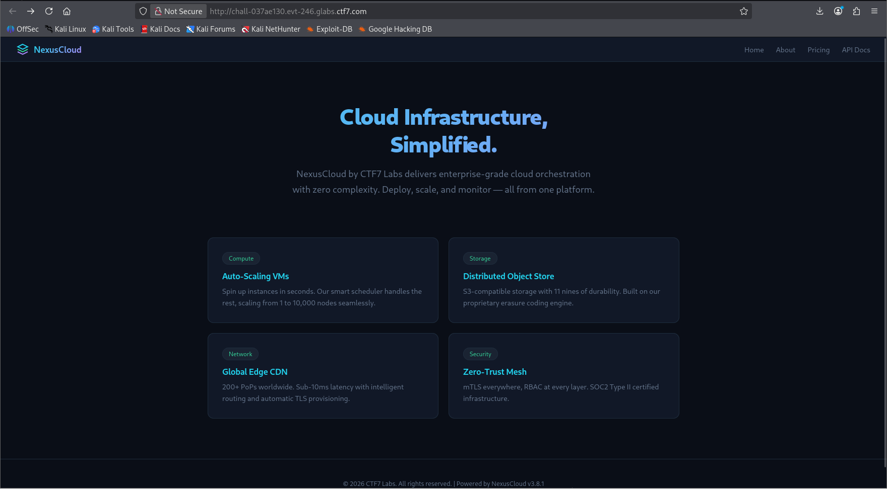
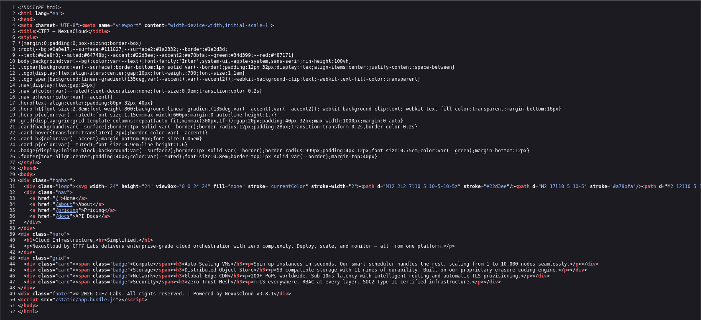
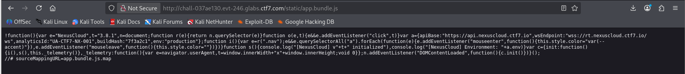
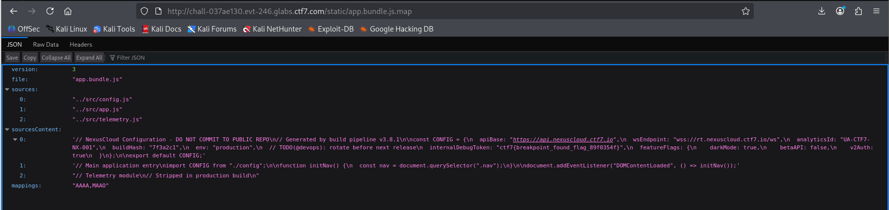
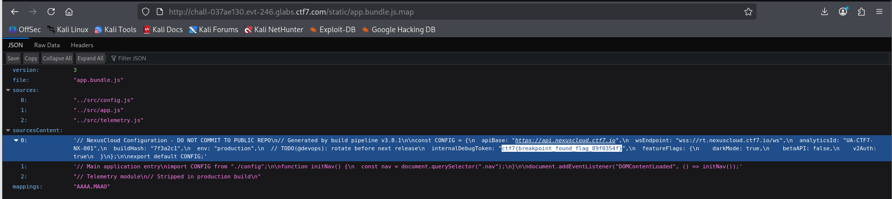

# Write-Up : Source Dive

**Plateforme :** MYTHX: AN ENDGAME PROTOCOL  
**Catégorie :** Web  
**Difficulté :** Easy  

# Objectif

L'objectif de ce challenge est d'explorer les actifs (assets) front-end de la plateforme NexusCloud pour identifier des informations sensibles laissées par inadvertance par l'équipe d'ingénierie.

<em>Interface du challenge présentant l'énoncé et les détails</em> 

## Analyse Initiale

Les informations extraites de la plateforme sont les suivantes :

* **Cible :** Plateforme d'infrastructure NexusCloud.

* **Indice :** Le texte mentionne que l'équipe a "livré un peu plus que prévu" dans les actifs front-end.

* **Format du flag :** `ctf7{ ... }`.

L'analyse commence par l'examen du code source HTML de la page d'accueil pour identifier les scripts chargés.

<em>Page d'accueil de la plateforme NexusCloud</em> 

## Recherche des Paramètres

L'inspection du code source HTML (ligne 50) révèle l'utilisation d'un fichier JavaScript consolidé :

``

<em>Code source HTML révélant le chemin du script app.bundle.js</em> 

En accédant directement à ce fichier, on constate que le code est minifié. Cependant, la présence d'un commentaire spécial à la fin du fichier attire l'attention :

`//# sourceMappingURL=app.bundle.js.map`

Ce paramètre indique l'existence d'un fichier de "Source Map", un outil de débogage qui contient souvent le code source original non compressé.

<em>Contenu du fichier app.bundle.js montrant la référence au Source Map</em> 

## Déchiffrement et Analyse

En naviguant vers `http://[URL]/static/app.bundle.js.map`, nous accédons à la structure JSON du mapping. La section sourcesContent contient l'intégralité du code source original des fichiers config.js, app.js et telemetry.js.

| Fichier Source | Contenu Critique identifié	| Type de donnée |
| :--- | :--- | :--- |
| src/config.js	| internalDebugToken | Secret / Flag |
| src/app.js | Logique d'initialisation | Code applicatif |
| src/telemetry.js | Module de télémétrie | Code applicatif |

L'analyse de la section 0 (correspondant à config.js) montre une variable nommée internalDebugToken accompagnée d'un commentaire demandant une rotation avant la prochaine version.

<em>Exploration du fichier .map révélant le contenu de config.js</em> 

## Synthèse du Flag

L'extraction directe depuis le code source original permet de récupérer le flag final :

* **Fichier source :** `src/config.js`

* **Variable :** internalDebugToken 

* **Valeur :** `ctf7{breakpoint_found_flag_89f0354f}` 

<em>Détail du flag trouvé dans la configuration de débogage</em> 

## Conclusion

Le challenge Source Dive illustre une vulnérabilité commune liée à la mauvaise configuration des environnements de production. L'oubli des fichiers Source Maps (.map) permet à un attaquant de reconstruire le code source original et d'y trouver des secrets, des commentaires ou des points d'entrée sensibles.

**Flag final :**

`ctf7{breakpoint_found_flag_89f0354f}`
