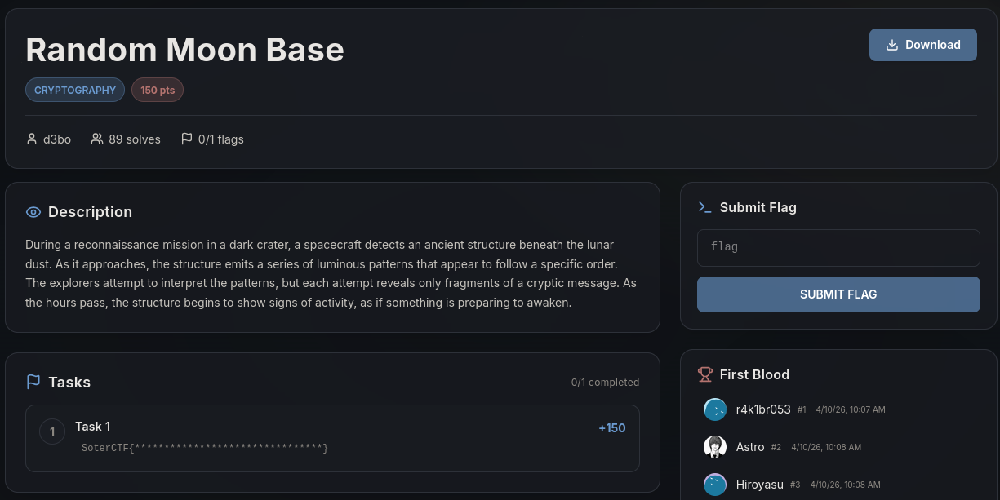
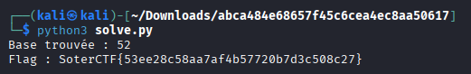

# Write-Up : Random Moon Base

**Plateforme :** SoterCTF  
**Catégorie :** Cryptography  
**Difficulté :** Medium  

# Objectif

L'objectif de ce challenge est de déchiffrer un message intercepté en analysant un script de chiffrement basé sur une conversion de base personnalisée utilisant un générateur de nombres pseudo-aléatoires (PRNG) prévisible.

<p align="center">

</p>
<p align="center"><em>Interface du challenge présentant l'énoncé et les détails de la mission lunaire </em> </p>

# Analyse Initiale

Les ressources fournies pour ce challenge sont les suivantes :

* **main.py :** Le script Python utilisé pour chiffrer le flag.

* **output.txt :** Le résultat du chiffrement : `+epfFznzIwf/iCXxSXNzFD/memrq8QPEM/EHOmiEAjxq+0si/oOpOTEEHsP`

* **Format du flag :** `SoterCTF{ ... }`

L'analyse du code source main.py révèle le fonctionnement suivant :

* Une base est choisie aléatoirement entre 10 et 60.

* Cette base sert de graine (seed) pour mélanger un alphabet Base64 standard via random.seed(base * 64).

* Le flag est converti en un grand entier, puis décomposé selon cette nouvelle base.

# Recherche des Paramètres

La vulnérabilité réside dans la fonction generate_base() et l'utilisation de random.seed.

```Python
def generate_base():
    return random.randint(10,60)

def to_str(res):
    alfabet = "ABCDEFGHIJKLMNOPQRSTUVWXYZabcdefghijklmnopqrstuvwxyz0123456789+/"
    random.seed(base * len(alfabet)) # Graine prévisible
    shufled = ''.join(random.sample(alfabet, len(alfabet)))
```

Puisque la base est comprise entre 10 et 60, il n'existe que 51 possibilités de graines différentes. Cela rend l'attaque par force brute extrêmement efficace.

## Déchiffrement et Analyse

Pour retrouver le flag, nous devons itérer sur toutes les bases possibles (10 à 60), reconstruire l'alphabet mélangé pour chaque base, et tenter de convertir le message de output.txt vers l'entier d'origine.

| Élément	| Valeur / Rôle	| Type de donnée |
| :--- | :--- | :--- |
| output	| +epfFznzIwf...	| Texte chiffré (Base personnalisée) |
| base	| Inconnue (10-60)	| Base de numération et Seed |
| shufled	| Alphabet réorganisé	| Clé de substitution |

Le script de résolution inverse le processus : il transforme chaque caractère en sa valeur numérique selon l'alphabet mélangé, puis multiplie par les puissances de la base choisie pour retrouver la valeur décimale du flag.

```Python
import random
import binascii

# Contenu de output.txt
output = "+epfFznzIwf/iCXxSXNzFD/memrq8QPEM/EHOmiEAjxq+0si/oOpOTEEHsP"
alfabet_orig = "ABCDEFGHIJKLMNOPQRSTUVWXYZabcdefghijklmnopqrstuvwxyz0123456789+/"

for base in range(10, 61):
    # 1. Recréer l'alphabet pour cette base
    random.seed(base * 64)
    shuffled = ''.join(random.sample(alfabet_orig, 64))
    
    # Map pour retrouver l'index depuis le caractère
    lookup = {char: i for i, char in enumerate(shuffled)}
    
    try:
        # 2. Convertir les caractères en valeurs numériques
        res = [lookup[c] for c in output]
        
        # 3. Reconstituer l'entier (Big Integer)
        # res[0] est le reste de la première division (poids faible)
        flag_deci = 0
        for i, val in enumerate(res):
            flag_deci += val * (base ** i)
        
        # 4. Convertir l'entier en bytes
        # On transforme l'entier en hexadécimal pour faciliter la conversion
        hex_string = hex(flag_deci)[2:]
        if len(hex_string) % 2 != 0:
            hex_string = '0' + hex_string
            
        flag = bytes.fromhex(hex_string).decode('utf-8', errors='ignore')
        
        if "SoterCTF{" in flag:
            print(f"Base trouvée : {base}")
            print(f"Flag : {flag}")
            break
    except Exception:
        continue
```

## Synthèse du Flag

En exécutant le script de force brute, nous identifions la base correcte utilisée lors de la génération.

* **Base identifiée :** 52

* **Graine correspondante :** 52×64=3328

* **Résultat :** Le script décode avec succès les octets et affiche le flag en clair.

<p align="center">

</p>
<p align="center"><em>Exécution du script de résolution révélant la base 52 et le flag final </em> </p>

## Conclusion

Le challenge Random Moon Base illustre parfaitement pourquoi la sécurité par l'obscurité et l'utilisation de générateurs de nombres aléatoires non cryptographiques (comme le module random de Python) avec des graines à faible entropie sont dangereuses. Une simple boucle de 50 itérations a suffi à annuler totalement le processus de chiffrement.

**Flag final :**

`SoterCTF{53ee28c58aa7af4b57720b7d3c508c27}`
