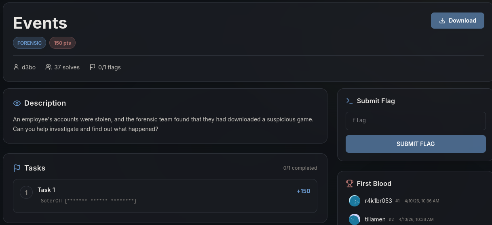
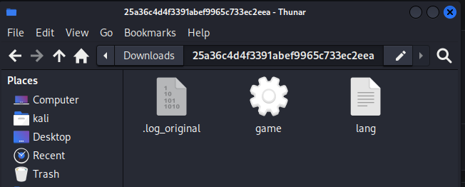
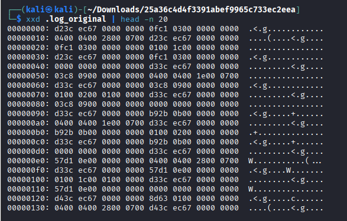
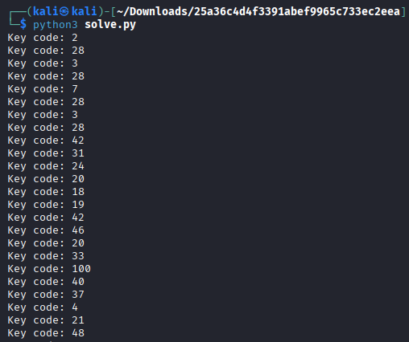
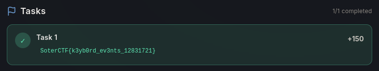

# Write-Up : Events

**Plateforme :** SoterCTF    
**Catégorie :** Forensic    
**Difficulté :** Medium    

## Objectif

L'objectif de ce challenge est d'enquêter sur le vol des comptes d'un employé. Les premières analyses indiquent que l'employé a téléchargé un jeu suspect qui a servi de vecteur pour exfiltrer ses données.

<p align="center">

</p>
<p align="center"><em>Interface du challenge présentant l'énoncé et les fichiers à télécharger</em> </p>

## Analyse Initiale

Après avoir téléchargé l'archive, nous nous retrouvons avec trois fichiers distincts dans le répertoire de travail :

* **game :** Un exécutable binaire (ELF 64-bit).

* **lang :** Un fichier texte ASCII.

* **.log_original :** Un fichier caché contenant des données binaires (type data).

<p align="center">

</p>
<p align="center"><em>Archive contenant les 3 fichiers</em> </p>

L'analyse du fichier lang révèle une information cruciale sur l'environnement de la victime :
System Locale: `LANG=en_US.UTF-8`, mais surtout un agencement de clavier espagnol (VC Keymap: es, X11 Layout: es).

## Recherche et Investigation

L'analyse de l'exécutable game avec la commande strings montre des références à figlet et au nom du challenge, mais aucun flag en clair. L'hypothèse s'oriente alors vers un keylogger (enregistreur de frappe).

Le fichier `.log_original` semble être une capture brute des événements d'entrée Linux (/dev/input/event). En utilisant la commande `xxd`, on observe une structure répétitive de blocs de 24 octets, typique des structures `input_event` du noyau Linux.

<p align="center">

</p>
<p align="center"><em>Examen hexadécimal du fichier de log montrant les scancodes binaires</em> </p>

## Déchiffrement et Analyse

Pour lire ces données, un script Python est utilisé pour parser les scancodes (les codes numériques envoyés par le clavier) : 

```python
import struct

FORMAT = 'QQHHi'
EVENT_SIZE = struct.calcsize(FORMAT)

with open(".log_original", "rb") as f:
    while True:
        buffer = f.read(EVENT_SIZE)
        if not buffer or len(buffer) < EVENT_SIZE:
            break
        
        sec, usec, type, code, value = struct.unpack(FORMAT, buffer)
        
        # type == 1 signifie un événement de touche (Key Event)
        # value == 1 signifie touche pressée
        if type == 1 and value == 1:
            print(f"Key code: {code}")
```

<p align="center">

</p>
<p align="center"><em>Extrait de l'exécution du fichier python pour afficher les Linux Keycodes</em> </p>

| Code Touche (ScanCode) | Interprétation (Layout ES) |
| :--- | :--- |
| 31, 24, 20, 18, 19, 46, 20, 33	| SOTERCTF |
| 100 + 40	| { (AltGr + 2 sur clavier espagnol) | 
| 37, 4, 21, 48, 11, 19, 32	| K3YB0RD |
| 42 + 53	| _ (Shift + /) |
| 18, 47, 4, 49, 20, 31	| EV3NTS |

Le dernier segment de scancodes (2, 3, 14, 4, 14, 3, 9, 4, 2, 8, 3, 3, 14, 2) contient plusieurs fois le code 14, qui correspond à la touche Backspace (Effacer). Contrairement à une analyse de texte classique, le flag ici nécessite de conserver la séquence brute des touches pressées par l'utilisateur, incluant ses erreurs de frappe.

## Synthèse du Flag

En assemblant les caractères traduits selon le mapping du clavier espagnol et en respectant la saisie brute (incluant les corrections ratées de l'utilisateur), nous obtenons la chaîne finale.

* **Prefixe :** `SoterCTF{`

* **Partie 1 (Keyboard) :** `K3YB0RD`

* **Partie 2 (Challenge Name) :** `EV3NTS`

* **Partie 3 (Séquence numérique brute) :** `12328317221`

<p align="center">

</p>
<p align="center"><em>Flaf final</em> </p>

## Conclusion

Le challenge Events illustre comment un malware peut capturer les interactions bas niveau avec le matériel. La difficulté résidait dans l'identification du layout de clavier (espagnol) et dans la compréhension que le flag attendait une saisie "brute" des touches plutôt que le résultat final nettoyé.

**Flag final :**

`SoterCTF{K3YB0RD_EV3NTS_12328317221}`
