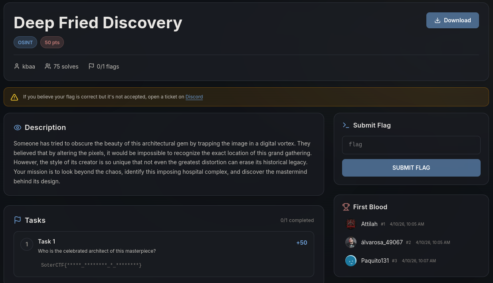
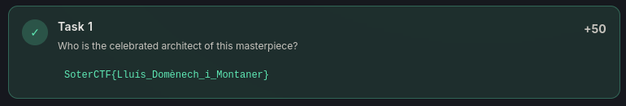

# Write-Up : Deep Fried Discovery

**Plateforme :** SoterCTF
**Catégorie :** OSINT
**Difficulté :** Easy

## Objectif

L'objectif de ce challenge est d'identifier un monument historique à partir d'une image ayant subi une forte distorsion numérique (effet "swirl") et de trouver l'architecte derrière sa conception.

<em>Interface du challenge présentant l'énoncé et la tâche à accomplir</em> 

## Analyse Initiale

Les informations extraites de la plateforme et de l'image sont les suivantes :

* **Description :** L'énoncé mentionne un "joyau architectural" piégé dans un "vortex numérique". Il précise qu'il s'agit d'un imposant complexe hospitalier.

* **Indices visuels :** Malgré la déformation, les bords de l'image révèlent des bâtiments en briques rouges avec des toitures en céramique colorée et des dômes ornés.

* **Format du flag :** `SoterCTF{*****_********_i_********}`

L'esthétique globale (briques, mosaïques, style organique) pointe immédiatement vers le Modernisme Catalan, un mouvement architectural majeur à Barcelone.

<em>Image originale fournie avec la distorsion en spirale</em> 

## Recherche et Identification

En croisant les mots-clés "Hospital complex Barcelona Modernism" ou "Hôpital brique rouge Barcelone", un résultat ressort : l'Hôpital de la Santa Creu i Sant Pau.

Ce complexe, classé au patrimoine mondial de l'UNESCO, correspond parfaitement aux structures visibles sur les zones non déformées de la photo (les pavillons symétriques et les jardins).
Indice Visuel	Correspondance Architecturale	Localisation
Briques rouges & Céramiques	Modernisme Catalan	Barcelone, Espagne
Complexe Hospitalier	Hospital de Sant Pau	Carrer de Sant Antoni Maria Claret

## Déchiffrement et Synthèse

Une fois le lieu identifié, il suffit de rechercher l'architecte principal de ce chef-d'œuvre. Il s'agit de Lluís Domènech i Montaner, l'un des rivaux et contemporains de Gaudí.

Le format du flag attendu correspond parfaitement au nom de l'architecte :

* Lluís (5 lettres)

* Domènech (8 lettres)

* i (liaison)

* Montaner (8 lettres)

<em>Validation du flag sur la plateforme</em> 

## Conclusion

Le challenge Deep Fried Discovery démontre que même une distorsion graphique agressive ne peut effacer la signature visuelle d'un monument historique unique. L'OSINT ici reposait sur l'analyse de motifs architecturaux spécifiques pour remonter jusqu'à la source.

**Flag final :**

`SoterCTF{Lluís_Domènech_i_Montaner}`
