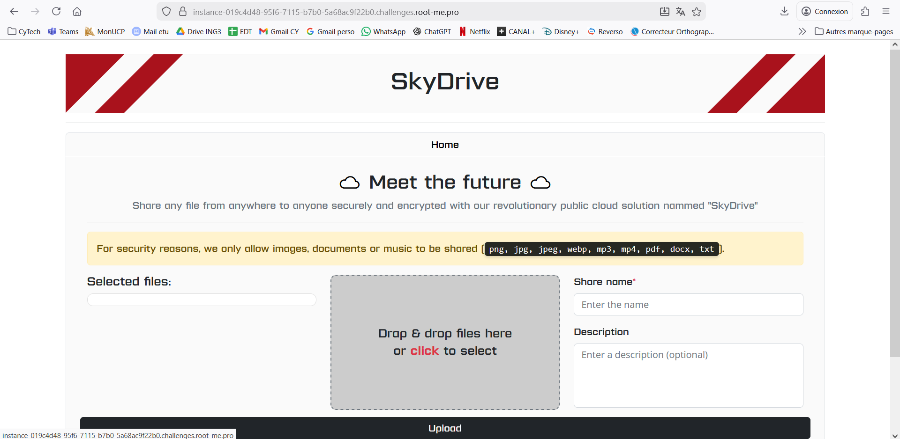
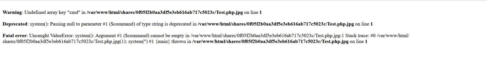

## Challenge : La coopération est la meilleure solution

**Catégorie :** Web / Double Extension  
**Difficulté :** Facile  

### Analyse

Ce challenge présente les mêmes fonctionnalités mais avec une restriction sur les extensions autorisées (png, jpg, pdf, etc.).

<em>Restrictions d'extensions visibles sur l'interface</em>

### Contournement : Double Extension

Pour contourner la sécurité, le fichier test.php a été renommé en **test.php.jpg**. Le serveur accepte le fichier car il se termine par **.jpg**, mais l'interpréteur PHP exécute tout de même le code car **.php** est présent dans le nom.

<em>Confirmation de l'exécution du code PHP malgré l'extension .jpg</em>

Et pour la suite on fait la même méthode que pour le challenge **File Upload** pour trouver le flag.

**Flag récupéré :** RM{FLAG_RECUPERE_AVEC_SUCCES}
