# Write-Up : Mr Robot CTF (TryHackMe)

**Plateforme :** TryHackMe  
**Objectif :** Trouver les 3 clés (flags) cachées dans la machine.  

## Étape 1 : Reconnaissance et Flag 1

L'attaque commence par un scan **Nmap** pour identifier les ports ouverts sur l'adresse IP cible.

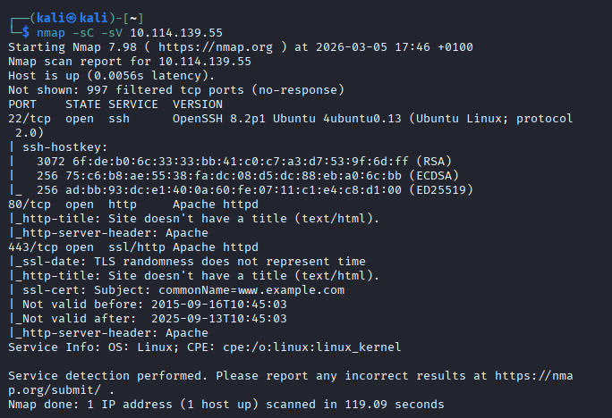

<em>Scan Nmap : Ports 80 (HTTP) et 443 (HTTPS) ouverts</em>

L'accès via le navigateur affiche une interface spécifique. L'inspection du code source ne révèle rien d'immédiat.

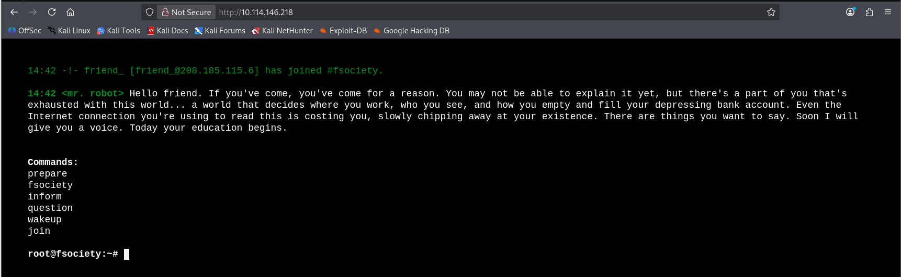

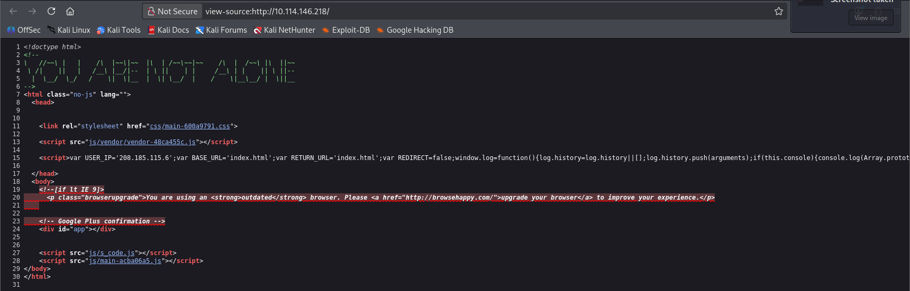

En testant l'URL /robots.txt, deux fichiers intéressants sont découverts : key-1-of-3.txt et une wordlist fsocity.dic.

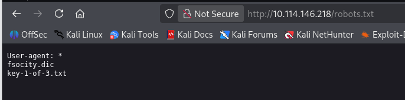

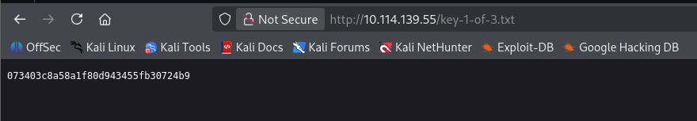

En affichant le fichier `key-1-of-3.txt`, on y trouve le premier flag.

**Flag 1 :** 073403c8a58a1f80d943455fb30724b9

## Étape 2 : Énumération Web et Brute Force

L'utilisation de **Gobuster** permet d'identifier l'arborescence du site, notamment les répertoires **WordPress**.

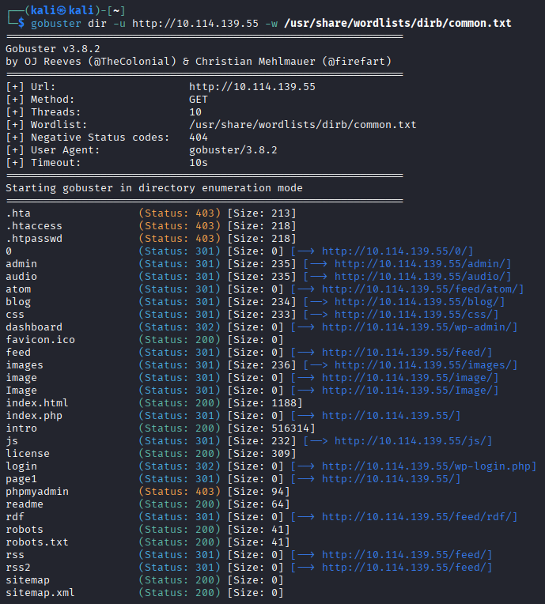

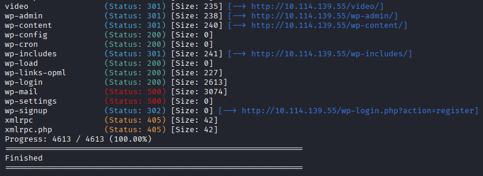

Sur la page /license, une chaîne encodée en **Base64** est trouvée. Son décodage permet d'obtenir des identifiants de connexion.

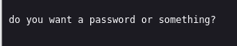

<em>Identifiants trouvés : elliot / ER28-0652</em>

## Étape 3 : Accès Initial et Shell

Une fois connectée sur l'administration WordPress, j'utilise l'éditeur de thèmes pour modifier le fichier 404.php et y injecter un **Reverse Shell PHP**.

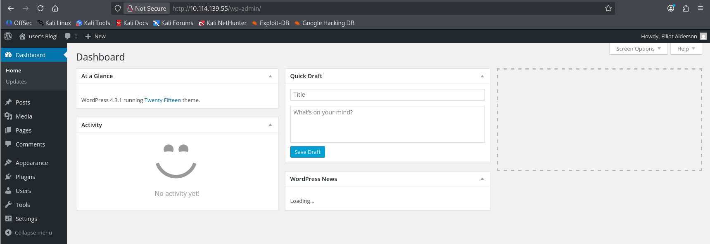

<em>Modification du template 404.php pour obtenir un accès</em>

Après avoir configuré un listener Netcat (nc -lvnp 1234), l'exécution de la page 404 me donne un accès shell en tant qu'utilisateur daemon.

## Étape 4 : Flag 2 et Élévation de Privilèges

Dans le répertoire `/home/robot`, on trouve le deuxième flag et un fichier contenant un hash MD5 du mot de passe de l'utilisateur "robot".

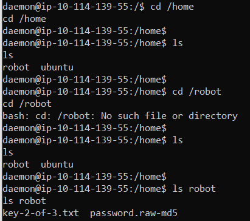

Le hash est cassé via **CrackStation**, ce qui permet de se connecter en tant qu'utilisateur robot et de lire la deuxième clé.

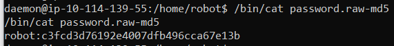

    **Flag 2 :** 822c73956184f694993bede3eb39f959

## Étape 5 : Privilèges Root (Flag 3)

La recherche de fichiers avec le bit **SUID** révèle que **Nmap** peut être exécuté avec les privilèges de l'utilisateur root.

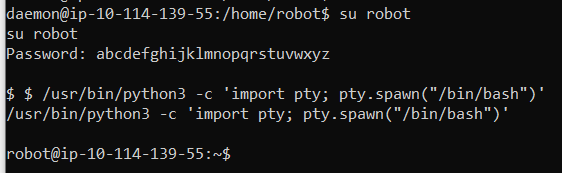

En utilisant le mode interactif de Nmap (nmap --interactive), il est possible de solliciter un shell système qui s'ouvre avec les droits **root** (indiqué par le symbole #).

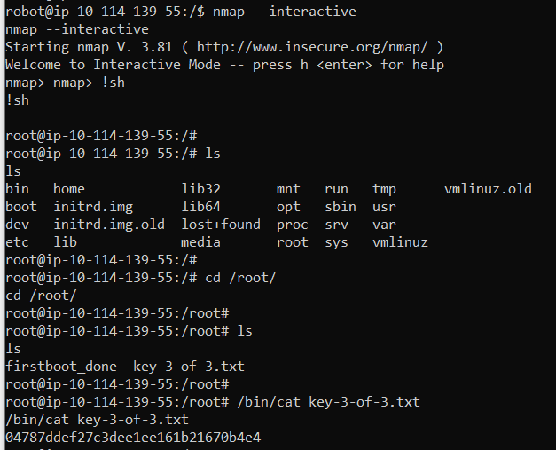

    **Flag 3 :** 04787ddef27c3dee1ee161b21670b4e4

## Analyse des Vulnérabilités et Remédiations
| Vulnérabilité	| Impact	| Remédiation (Conseil ANSSI) |
| :--- | :--- | :--- |
| Exposition d'infos	| Fuite de secrets via robots.txt	| Ne jamais stocker de clés dans des fichiers publics. |
| Messages verbeux	| Aide à la découverte d'identifiants	| Utiliser des messages d'erreur génériques. |
| Obsolescence	| WordPress non mis à jour	| Maintenir une veille et appliquer les correctifs. |
| MDP Faible	| Brute force facilité	| Politique de 16 caractères minimum. |
| Hachage MD5	| Vulnérable aux collisions	| Utiliser des algos modernes (Argon2, bcrypt). |
| Bit SUID mal configuré	| Élévation de privilèges (LPE)	| Principe du moindre privilège sur les binaires. |
