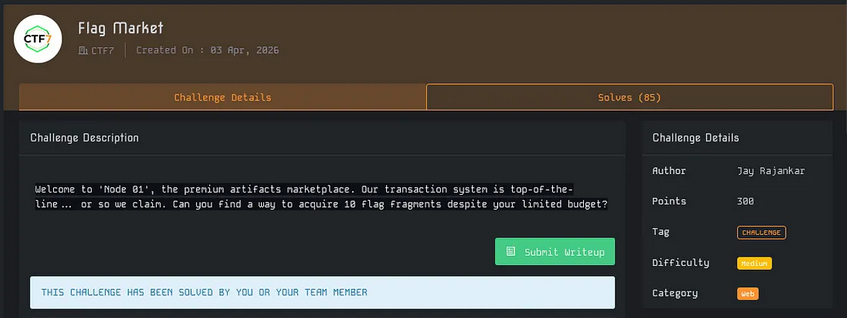
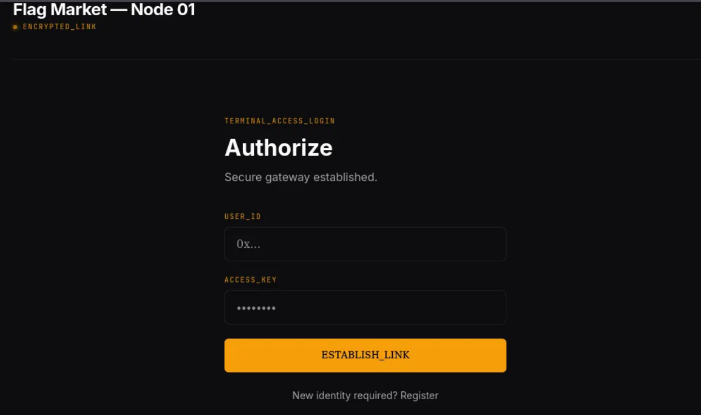
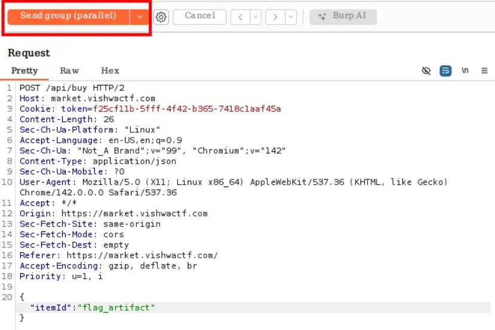
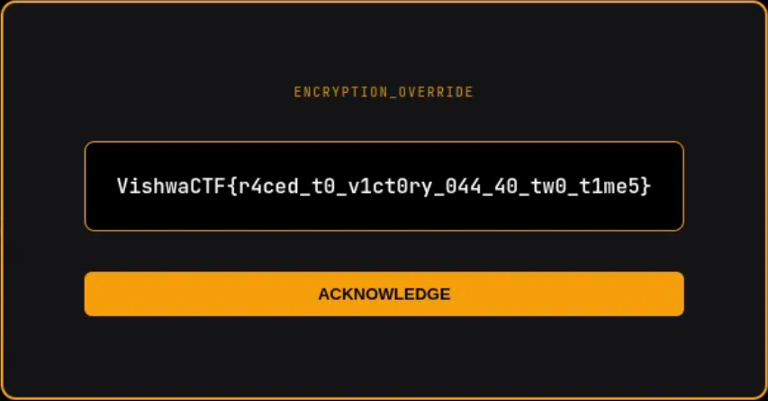

# Write-Up : Flag Market

**Plateforme :** VishwaCTF 2026    
**Catégorie :** Web    
**Difficulté :** Medium    

## Objectif

L'objectif de ce challenge est d'acquérir 10 fragments de flag dans une boutique d'artefacts cyberpunks. Le problème est mathématique : chaque fragment coûte 1000 CR, mais l'utilisateur ne dispose que d'un solde initial de 1000 CR. Il faut donc trouver un moyen de contourner la vérification du solde.

<em>Challenge Flag Market</em> 

<em>Interface "TERMINAL_ACCESS" demandant une authentification</em> 

## Analyse Initiale

Après création d'un compte et connexion à "Node 01", l'interface révèle les informations suivantes :

* **Solde :** 1000 CR.

* **Objectif :** 10/10 ARTIFACT_SYNC.

* **Boutique :** Le "Flag Artifact" est listé à 1000 CR l'unité.

Si nous achetons un seul artefact de manière légitime, notre solde tombe à 0, rendant impossible l'obtention des 9 autres. L'absence de validation stricte de l'atomicité des transactions suggère une vulnérabilité de type Race Condition (Condition de concurrence).

## Recherche des Paramètres

En interceptant la requête d'achat avec Burp Suite, on identifie l'appel API suivant lors du clic sur le bouton "ACQUIRE" :

`POST /api/buy HTTP/2`

`Content-Type: application/json`

`{"itemId":"flag_artifact"}`

Le système semble vérifier le solde (CHECK), puis valider l'achat et enfin déduire les crédits (USE). S'il y a un délai entre la vérification et la déduction, nous pouvons glisser plusieurs requêtes dans cet intervalle.

## Déchiffrement et Analyse (Exploitation)

Pour exploiter cette faille TOCTOU (Time-Of-Check to Time-Of-Use), la méthode la plus efficace consiste à envoyer un groupe de requêtes en parallèle :

* Envoyer la requête `POST /api/buy` vers le Repeater de Burp Suite.

* Créer un groupe d'onglets (10 ou plus) contenant cette même requête.

* Utiliser la fonction "Send group (parallel)".

| Méthode | Action | Résultat attendu |
| :--- | :--- | :--- |
| Standard | Achat séquentiel | Échec après le 1er achat (Solde : 0) |
| Race Condition | 15 requêtes simultanées | Succès multiple avant la mise à jour du solde |

<em>Envoi groupé des requêtes pour saturer le processus de vérification</em> 

## Synthèse du Flag

En rafraîchissant le tableau de bord après l'attaque, on constate que le compteur ARTIFACT_SYNC est passé à 11/10. Le serveur a traité toutes les requêtes en parallèle, considérant pour chacune d'elles que nous avions encore les 1000 CR initiaux.

* **Inventaire :** 11 x Flag Artifact

* **Crédits restants :** 0 CR (une seule déduction a été enregistrée avec succès)

* **Résultat :** L'écran "ENCRYPTION_OVERRIDE" se déverrouille automatiquement.

<em>Affichage du flag final après l'exploitation réussie</em> 

## Conclusion

Le challenge Flag Market démontre l'importance de l'atomicité dans les transactions financières sur le Web. Sans verrouillage approprié de la base de données (Database Locking) lors de la vérification du solde, un attaquant peut multiplier son pouvoir d'achat artificiellement.

**Flag final :**

`vishwactf{r4c3_c0nd1t10n_1s_f0r_th3_w1nn3rs_9281}`
